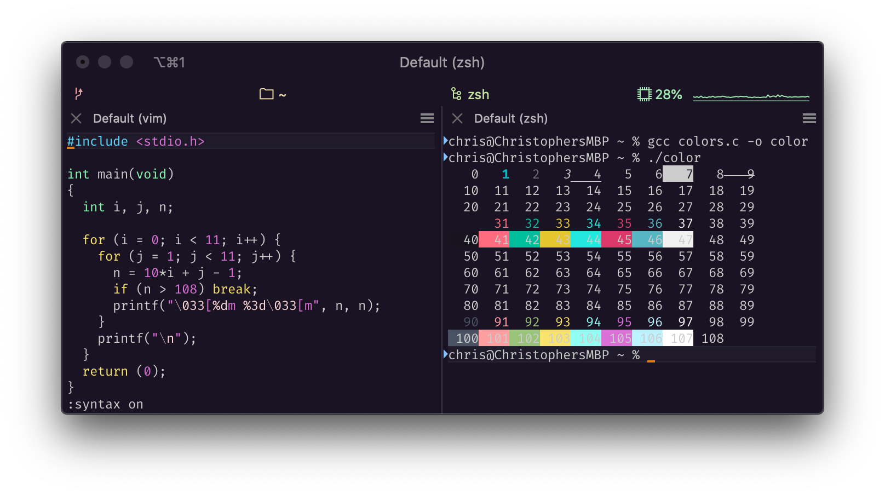
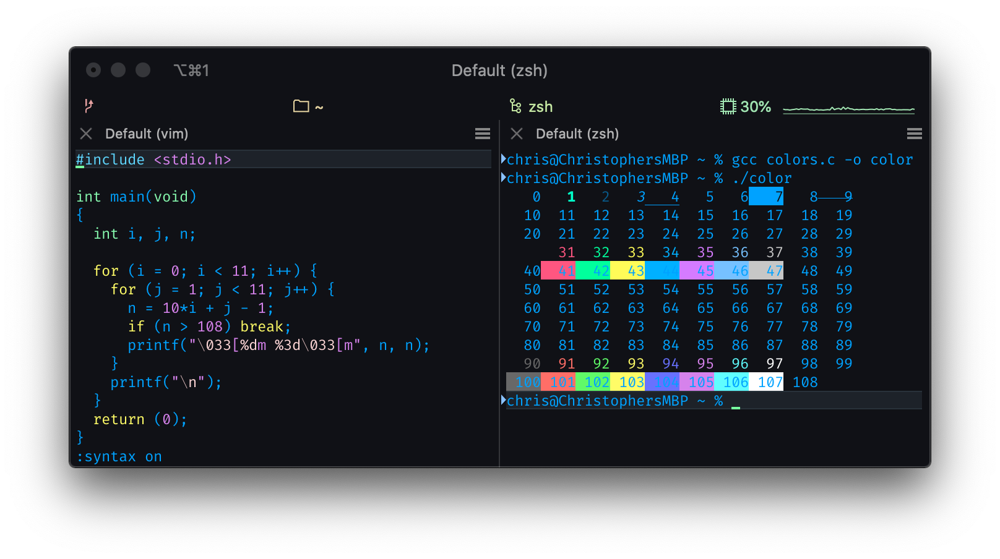
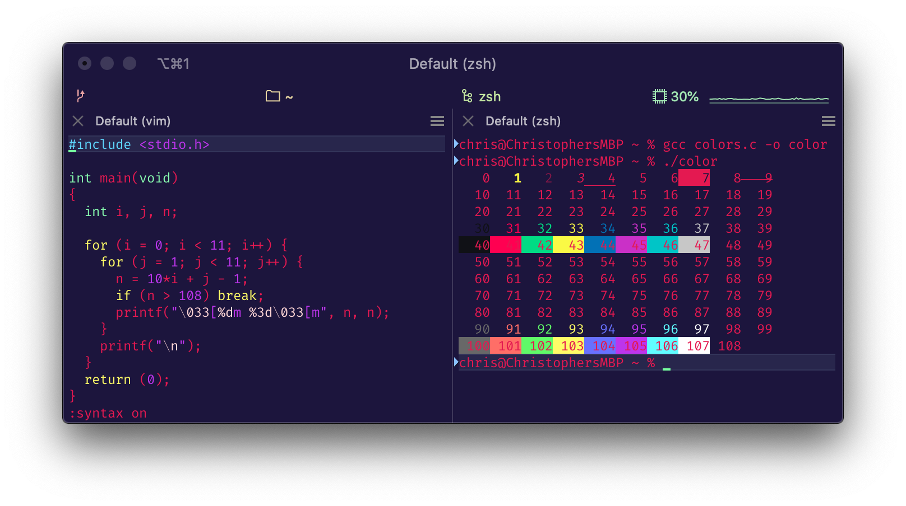

# Config
My dev configuration files

## Keybindings

For keybindings, create a symlink to this file from:

    ~/Library/Application Support/Code/User/keybindings.json

## Themes

### Blueberry Banana

### Blue Matrix

### Cyberdyne

### Laser

### Scarlet Protocol

