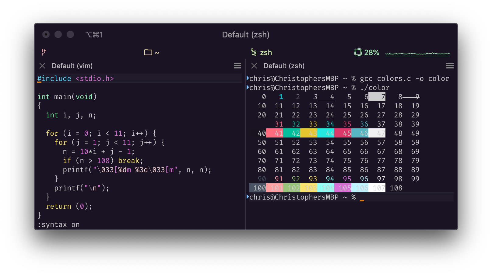
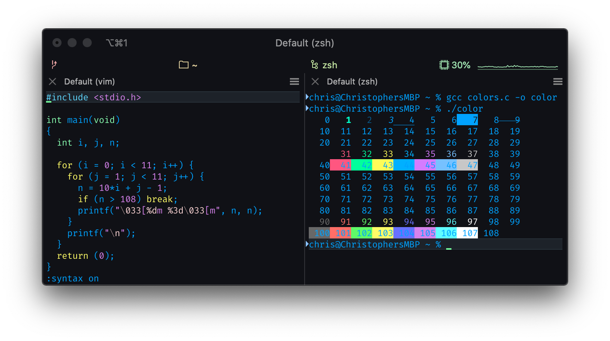
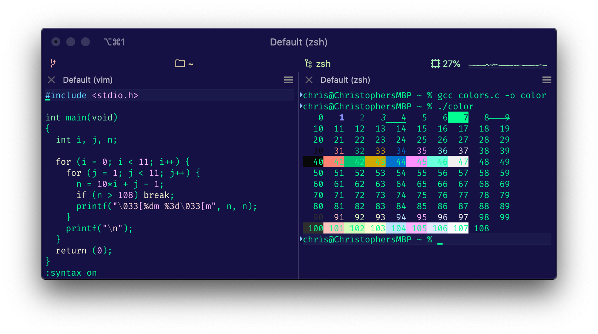
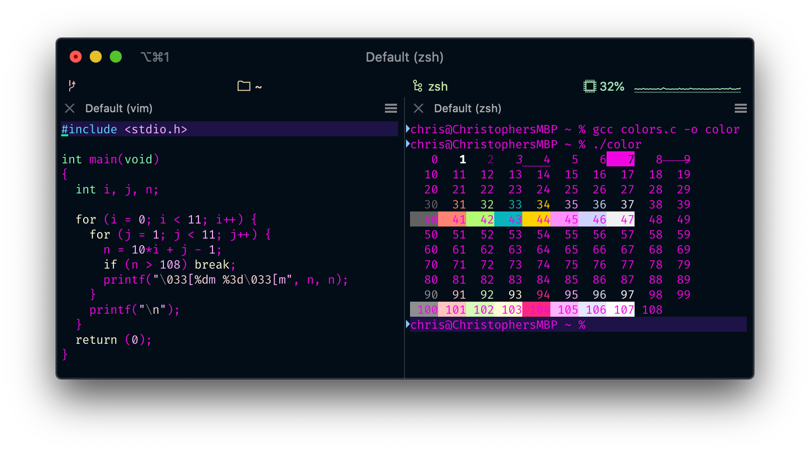
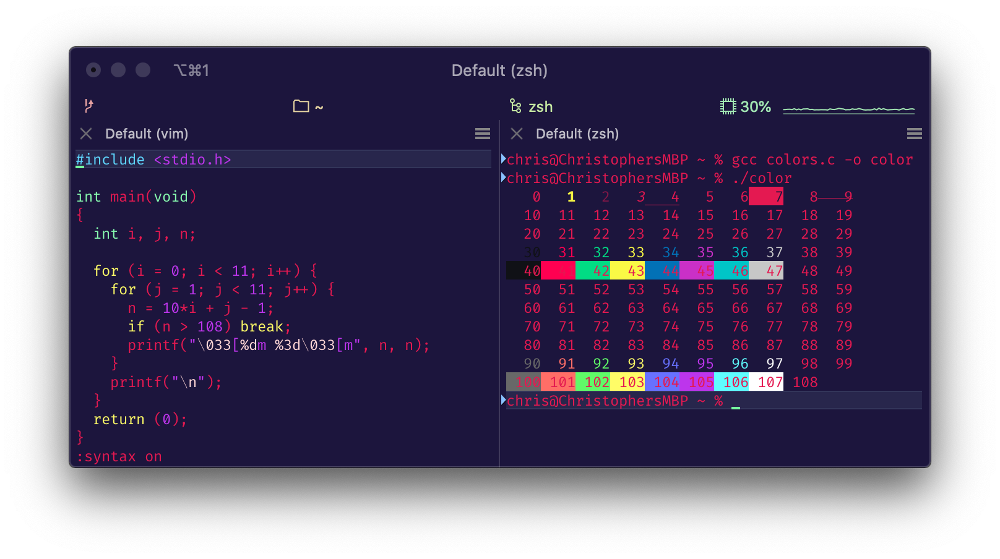

# Config
My dev configuration files

## tmux +  VSCode Setup

For keybindings and settings, create a symlinks to the files like so:

    ~ % ln -s Config/vscode_config/settings.json  ~/Library/Application\ Support/Code/User/settings.json
    ~ % ln -s Config/vscode_config/settings.json  ~/Library/Application\ Support/Code/User/settings.json
    ~ % ln tmux_config/tmux.conf ~/.tmux.con

## `tmux` Note

Install [tpm](https://github.com/tmux-plugins/tpm) to manage plugins

## iTerm 2 Themes

### Blueberry Banana

### Blue Matrix

### Cyberdyne

### Laser

### Scarlet Protocol

